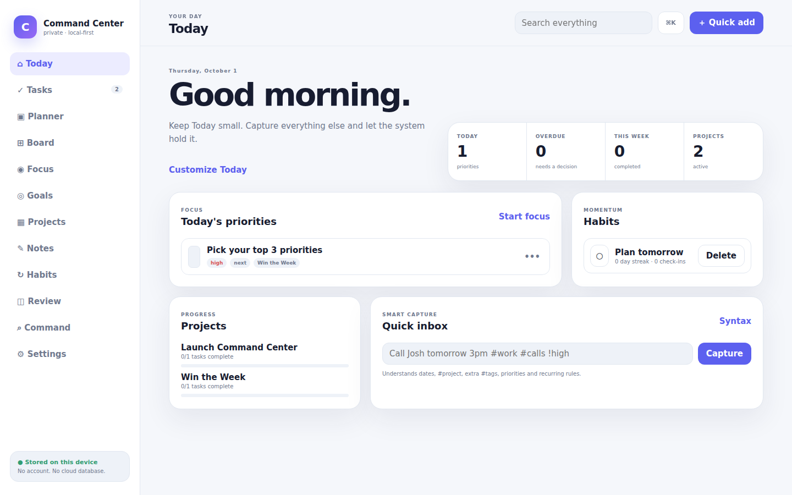
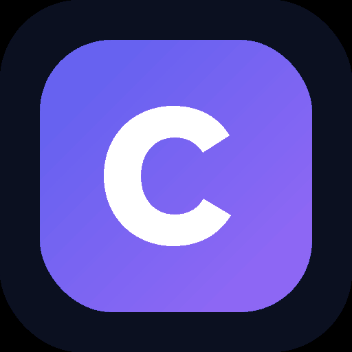
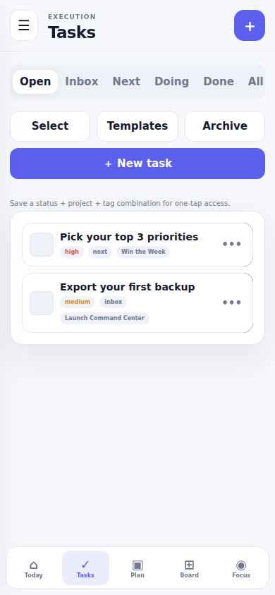

# Command Center

<p align="center">
  
</p>

<p align="center">
  
</p>

<p align="center"><strong>A private, local-first productivity PWA built to separate Signal from Noise, finish the few things that matter today, and keep everything else safely parked.</strong></p>

[](https://github.com/BTheCoderr/simpleToDoList/actions/workflows/ci.yml)


**Live app:** https://command-center-local.netlify.app

<!-- repo-intro:start -->
**Project snapshot:** Command Center is a private, local-first personal productivity system that evolved from a simple to-do list into an installable PWA with planning, focus, goals, habits, review workflows, recovery tools, privacy controls, exports, and browser QA.

**Current product:** v8.2 · Signal First + Lock-In · browser-native JavaScript · IndexedDB schema v4 · installable/offline PWA · no account service · no cloud database.

**What it demonstrates:** JavaScript · IndexedDB · PWA/offline architecture · Playwright E2E · local-first product design · progressive enhancement · release hardening.
<!-- repo-intro:end -->

<!-- portfolio-refresh:start -->
## Product experience

Command Center is built around a stricter loop: **decide → Lock In → capture distractions → finish → clear → review**. Capture still matters, but captured work stays Noise until it deliberately earns one of today's limited Signal slots.

<p align="center">
  
</p>

### Signal + Noise

- explicit daily **Signal** of 3–5 Must-Wins
- hard cap of 5 Signal items to prevent priority inflation
- guided **Morning Signal Builder** for the first daily check-in
- one-tap **Promote to Signal** / **Park as Noise** controls
- forced **swap-at-5** when Signal is full instead of silent priority inflation
- Noise parking lot on the main dashboard
- Focus Mode groups today's Signal before all other open work and advances to the next Must-Win after completion
- full-screen **Lock-In Mode** removes the rest of the workspace and keeps one Must-Win on screen
- Lock-In distraction capture sends stray thoughts directly to Noise without leaving the work
- a one-line **daily intent** keeps the reason for today's Signal visible
- **Signal Clear** ends the day deliberately when the final Must-Win is finished
- 7-day Signal History shows what was chosen and what actually got finished
- Noise Aging surfaces 7 / 14 / 30-day stale work with keep, archive, trash, or promote decisions
- Daily Shutdown creates tomorrow's Signal
- Weekly Review shows which projects and goals actually received Signal
- Weekly planning can pre-seed Monday's Signal

### Capture + organize

- Inbox / Next / Doing / Done task workflow
- Smart Quick Add with dates, priorities, projects, tags, and recurring rules
- Saved Task Views and filters
- Multi-select bulk actions
- Projects, Goals, Notes, and Habits
- Subtasks and recurring tasks

### Plan + execute

- Month / Week / Day Planner
- Drag-to-reschedule
- Quick Today / Tomorrow / +1 week actions
- Persistent Kanban ordering
- Focus Mode with selectable work sessions
- Goal → Project → Task hierarchy
- Customizable Signal dashboard

### Review + recover

- Daily Shutdown
- Weekly Review
- Analytics
- searchable Activity History
- Archive / Trash / Undo
- rotating local snapshots
- validated JSON backup/import
- Tasks CSV export
- Workspace Markdown export

### Privacy + offline

- all primary workspace data stays in IndexedDB on the device
- no account system and no cloud database
- optional PBKDF2-based local privacy lock
- installable standalone PWA
- offline app shell and offline deep-link support
- controlled service-worker update activation
- Web Share Target capture
- iPhone Add to Home Screen guidance
- theme-aware browser/app chrome
<!-- portfolio-refresh:end -->

## Architecture

```text
Browser / Installed PWA
        │
        ├── UI + workflows ─────► public/app.js
        ├── task logic ─────────► public/core.js
        ├── persistence ────────► IndexedDB via public/storage.js
        ├── backup validation ──► public/backup.js
        ├── local privacy ──────► public/privacy.js
        ├── exports ────────────► public/exporters.js
        └── offline shell ──────► public/sw.js
```

The application deliberately stays dependency-light and browser-native. The IndexedDB database name `command-center-v2` is retained on purpose so existing local data remains visible while the schema evolves.

## Tech stack

| Layer | Technology |
| --- | --- |
| UI | HTML + CSS + browser-native JavaScript |
| Local data | IndexedDB schema v4 |
| Preferences | localStorage / sessionStorage |
| Offline / install | Web App Manifest + Service Worker |
| Privacy | Web Crypto PBKDF2 + SHA-256 |
| Exports | JSON, CSV, Markdown |
| QA | Node regression suite + Playwright Chromium E2E |
| Hosting | Netlify |

## PWA

Command Center is a real installable Progressive Web App, not just a mobile-shaped website.

- `display: standalone`
- 180×180 Apple touch icon
- 192×192 and 512×512 PNG icons
- 512×512 maskable icon
- offline cache `command-center-v20`
- offline navigation/deep-link fallback
- Web Share Target
- browser install prompt where supported
- iPhone Safari Add to Home Screen guidance
- natural device orientation
- theme-aware app chrome
- controlled **New version ready → Reload** update flow

## Local storage model

IndexedDB stores:

- tasks (including the schema-free `signalDate` field used to mark a task as Signal for a specific day)
- projects
- notes
- habits
- activity
- templates
- goals
- snapshots
- meta

UI preferences, Saved Views, Signal dashboard layout, Planner mode, and Privacy Lock metadata use localStorage/sessionStorage.

Snapshots keep up to 7 rotating recovery points and cap each snapshot at 4 MB. JSON import is capped at 8 MB and validates backup version, stores, and record shapes before local data is replaced.

## Quality gates

GitHub CI runs two release gates:

1. **Regression checks** — syntax, DOM wiring, migrations, recurrence, Quick Add, backup safety, PWA metadata, CSS structure, exports, privacy wiring, and dead-code checks.
2. **Playwright Chromium E2E** — real browser workflows for CRUD, Planner, Board, Focus, Goals, Review, History, recovery, exports, privacy lock, offline use, PWA behavior, 5,000-task stress, accessibility, and responsive layouts down to 320px.

Deployment is deliberately separate from GitHub changes. A green CI run or repo update is **not** treated as permission to publish a new Netlify production build.

## Repository guide

- [CHANGELOG.md](./CHANGELOG.md) — release history
- [ROADMAP.md](./ROADMAP.md) — shipped, improving, and exploring
- [CONTRIBUTING.md](./CONTRIBUTING.md) — development and review expectations
- [SECURITY.md](./SECURITY.md) — vulnerability reporting and local-first security model
- [LICENSE](./LICENSE) — repository usage terms
- [public/index.html](./public/index.html) — application shell
- [public/app.js](./public/app.js) — UI and workflow orchestration
- [public/core.js](./public/core.js) — task/date/recurrence logic
- [public/storage.js](./public/storage.js) — IndexedDB schema and migrations
- [public/sw.js](./public/sw.js) — PWA offline/update behavior
- [tests/e2e.spec.mjs](./tests/e2e.spec.mjs) — main browser QA
- [tests/pwa.e2e.spec.mjs](./tests/pwa.e2e.spec.mjs) — install/offline/PWA QA
- [tests/responsive.e2e.spec.mjs](./tests/responsive.e2e.spec.mjs) — mobile overflow coverage
- [.github/workflows/ci.yml](./.github/workflows/ci.yml) — automated quality gates

## Local setup

```bash
npm install
npm run dev
```

Then open:

```text
http://localhost:4000
```

Run the quality gates with:

```bash
npm test
npm run check
npm run e2e
```

## Release status

`master` is the source of truth for released code. The Signal First v8 work is merged there only after its regression and browser gates pass. Production can intentionally lag behind `master` while changes are being accumulated and tested before an approved Netlify deploy.

The product is designed to remain local-first: no server, account system, database service, API key, or environment variable is required for the core application.


## License

Copyright © 2026 Baheem Ferrell. All rights reserved. This public repository is viewable for portfolio, review, and collaboration purposes and is not released under an open-source license. See [LICENSE](./LICENSE).
